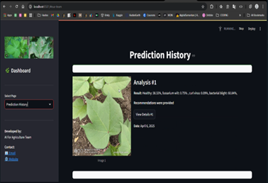
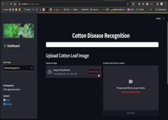
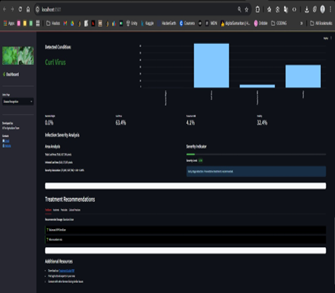
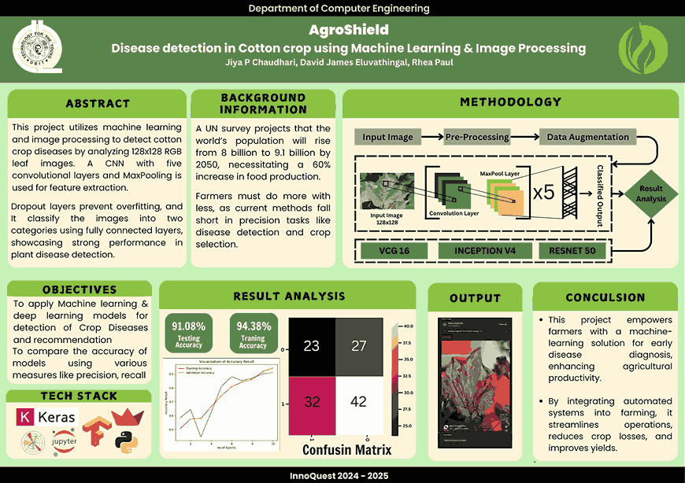

 # __AgroShield : Cotton Leaf Disease Detection using Machine Learning and Image Processing__

  

## 📖 Project Overview  
AgroShield is a project aimed at detecting cotton leaf diseases using advanced Machine Learning and Image Processing techniques. This project leverages computer vision and AI algorithms to analyze and identify diseases in cotton leaves, enabling early detection and mitigation of plant health issues, ultimately boosting productivity and ensuring sustainable cotton farming.

## 🚀 Key Features  
• __Accurate Disease Detection__ : Identifies various cotton leaf diseases with high accuracy.  
• __Machine Learning Integration__ : Utilizes cutting-edge machine learning models for detection.  
• __Image Processing Techniques__ : Processes leaf images to detect anomalies and diseases.  
• __User-Friendly Interface__ : Simple interface to visualize and analyze results.   
• __Self-Curated Dataset__ : The dataset used in this project has been created by myself, ensuring high-quality and customized data for accurate detection.  

## 📸 Website UI

  
  
  
  

## 🛠 Tech Stack  
• __Python__  
• __TensorFlow/Keras (For Machine Learning Models)__  
• __OpenCV (For Image Processing)__   
• __Scikit-learn (For Machine Learning Algorithms)__   
• __Matplotlib (For Visualization)__   

 

## Project Poster

  
